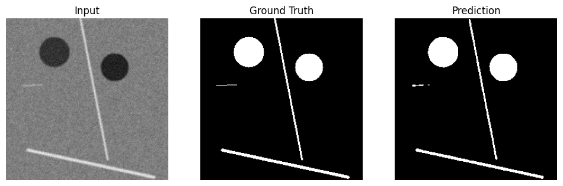
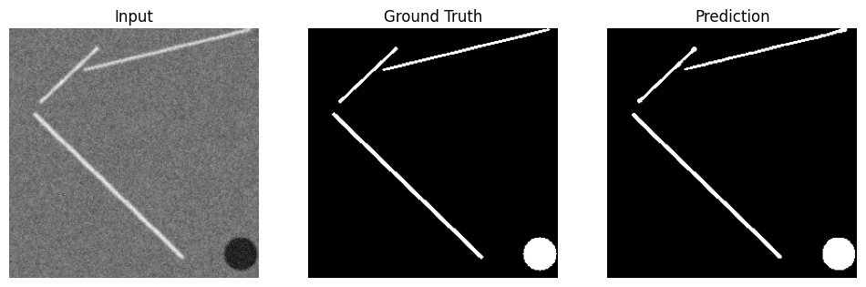
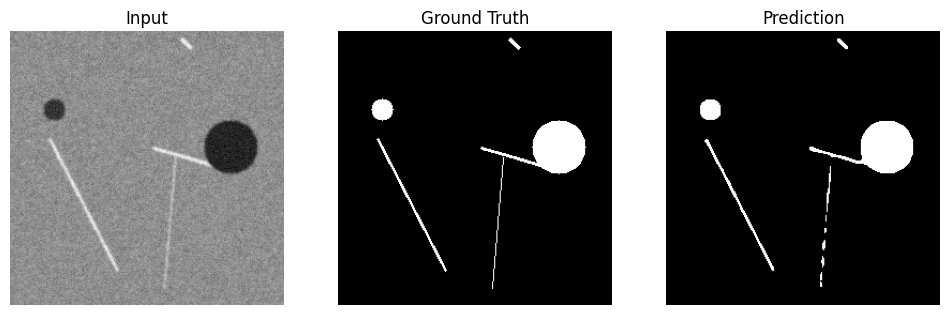

# Synthetic Surface Defect Segmentation with UNet
## Project Overview

This project demonstrates a semantic segmentation model using UNet to detect surface defects such as scratches, cracks, and stains on industrial materials. The dataset is fully synthetic and programmatically generated to simulate realistic surface imperfections. This approach highlights the ability to train a segmentation model even when annotated real-world data is scarce.

## Dataset Generation

The synthetic dataset consists of 256x256 grayscale images representing industrial surfaces. Defects are randomly generated as lines (scratches) and irregular blobs (stains). Gaussian blur and noise are applied to mimic realistic textures. Corresponding binary masks indicate defect regions. This allows for fully reproducible training data without manual annotation.

Example visualization of the dataset:

Input Surface: grayscale industrial texture with defects

Ground Truth Mask: binary mask highlighting defect areas

## Model Architecture

The model is a standard UNet with two downsampling/upsampling blocks and a bottleneck layer. Skip connections are used to preserve high-resolution features. The input is a single-channel grayscale image, and the output is a single-channel defect mask with a sigmoid activation.

## Training Details

The model is trained using a combination of Binary Cross Entropy (BCE) and Dice Loss. BCE ensures stable pixel-wise learning, while Dice Loss maximizes mask overlap and improves detection of small defects. The optimizer is Adam with a learning rate of 1e-4. The model is trained in batches of 8 images for 10 epochs, depending on dataset size, and can run on CPU or GPU.

## Results

After training, the model successfully segments synthetic surface defects. Example predictions show high overlap between generated ground truth masks and the model's predicted masks. Input images, ground truth, and predictions can be visualized side by side to demonstrate performance.

## Limitations

Since the model is trained entirely on synthetic data, real-world performance may require fine-tuning on actual surface images. Only grayscale surfaces are simulated; color surfaces or more complex textures would require additional augmentations.

## Future Work

Generate more realistic textures using GANs.

Extend to multi-class defect segmentation.

Fine-tune with real industrial datasets.

Apply advanced data augmentations such as rotation, perspective changes, and brightness adjustments.

## Ground Truth vs. Predictions

References

UNet: Convolutional Networks for Biomedical Image Segmentation